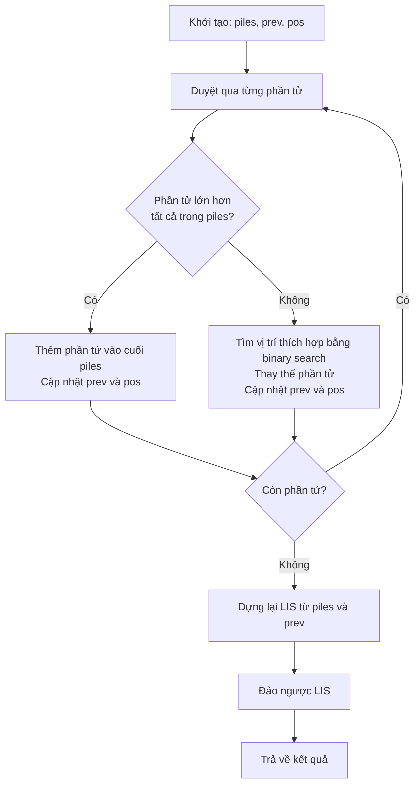
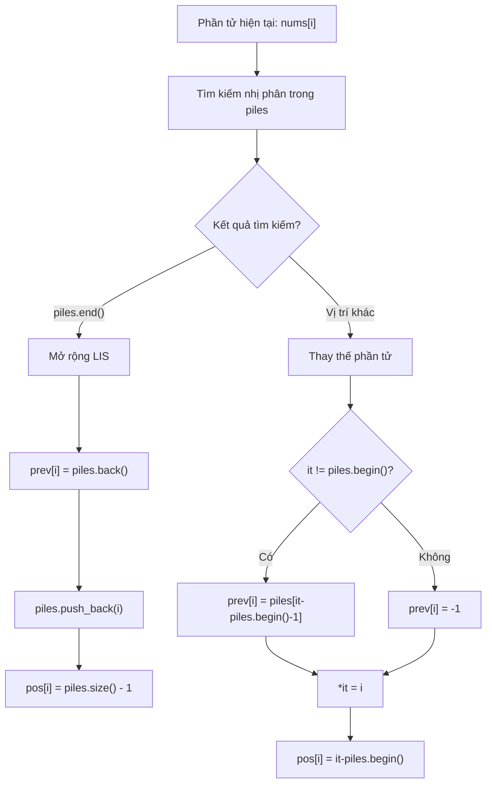
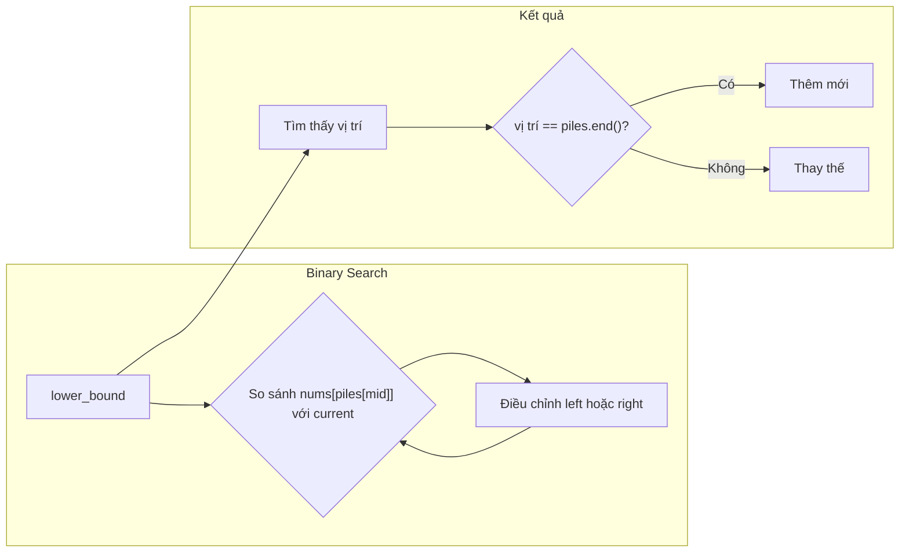
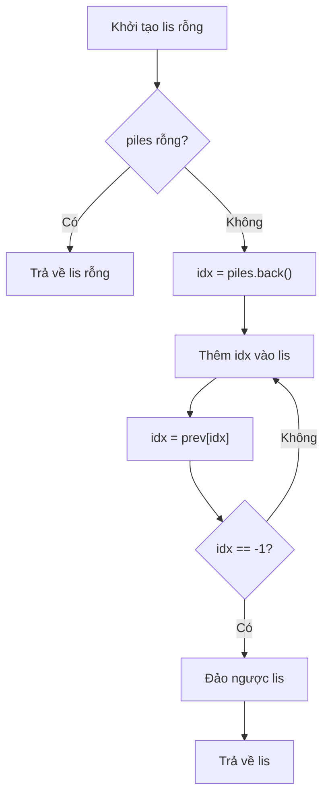
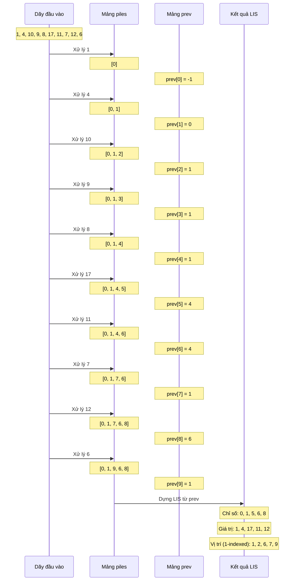

# Hướng dẫn thuật toán tìm dãy con tăng dài nhất (LIS)

Tài liệu này giải thích chi tiết về thuật toán tìm dãy con tăng dài nhất (Longest Increasing Subsequence - LIS) với độ phức tạp O(n log n) được cài đặt trong file `LIS.cpp`.

## Tổng quan thuật toán

Thuật toán này dựa trên ý tưởng của Patience Sort (Sắp xếp kiên nhẫn), sử dụng các "chồng bài" để xác định độ dài và phần tử của dãy con tăng dài nhất.

### Sơ đồ tổng quan của thuật toán

## Các cấu trúc dữ liệu chính

Thuật toán sử dụng ba cấu trúc dữ liệu chính để lưu trữ thông tin:

1. **piles**: Lưu chỉ số của phần tử nhỏ nhất kết thúc một dãy con tăng có độ dài i+1
2. **prev**: Lưu chỉ số của phần tử trước đó trong LIS kết thúc tại vị trí i
3. **pos**: Lưu vị trí trong LIS mà phần tử tại chỉ số i thuộc về

## Chi tiết quá trình xử lý mỗi phần tử

### Minh họa tìm kiếm nhị phân

## Quá trình dựng lại LIS

## Ví dụ minh họa

Với dãy đầu vào: `1, 4, 10, 9, 8, 17, 11, 7, 12, 6`

## Phân tích độ phức tạp

- **Thời gian**: O(n log n)
  - Vòng lặp chính: O(n)
  - Tìm kiếm nhị phân trong mỗi bước: O(log n)
  
- **Không gian**: O(n)
  - Mảng piles, prev, pos: mỗi mảng có kích thước O(n)

## Lưu ý quan trọng

Kết quả cuối cùng không nhất thiết phải chứa các phần tử cuối cùng của mỗi chồng. Điều này vì:

1. Khi dựng lại LIS, ta bắt đầu từ phần tử cuối cùng trong `piles` và sử dụng mảng `prev` để truy ngược lại.
2. Một phần tử có thể được thay thế trong một chồng, nhưng vẫn là một phần của LIS thực tế khi dựng lại từ mảng `prev`.
